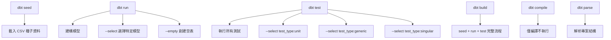

# 🧪 dbt Testing 完整指南：Unit Tests vs Data Tests

## 📋 測試類型概覽

| 特性 | Unit Tests | Data Tests |
|------|------------|------------|
| **目的** | 業務邏輯驗證 | 資料品質檢查 |
| **資料來源** | 模擬資料 (given) | 實際資料 (倉庫) |
| **執行速度** | 極快 (秒級) | 較慢 (分鐘級) |
| **資料庫依賴** | 需要父模型存在 | 需要實際資料 |
| **測試範圍** | 單一模型邏輯 | 整體資料品質 |
| **適用階段** | 開發、重構 | 生產監控 |

## 🏗️ 運作機制詳解

### 🧪 Unit Tests 運作機制

#### 1. **編譯階段**
```yaml
# properties.yml 中的定義
unit_tests:
  - name: test_stg_payments_amount_conversion
    model: stg_payments  # ← 需要驗證此模型存在
    given:
      - input: ref('raw_payments')  # ← 需要驗證父模型存在
```

**dbt 的處理流程**：
1. 解析 `stg_payments.sql` 中的所有 `ref()` 引用
2. 驗證 `raw_payments` 在倉庫中存在（即使會被替換）
3. 獲取表結構資訊進行編譯驗證

#### 2. **執行階段**
```sql
-- dbt 生成的實際測試 SQL (簡化版)
WITH raw_payments AS (
  -- 使用 given 區塊的模擬資料
  SELECT 1 as id, 101 as order_id, 'credit_card' as payment_method, 1500 as amount
  UNION ALL
  SELECT 2 as id, 102 as order_id, 'bank_transfer' as payment_method, 2000 as amount
),
stg_payments_test AS (
  -- 執行實際的 stg_payments 邏輯
  SELECT 
    id as payment_id,
    order_id,
    payment_method,
    amount / 100 as amount  -- ← 測試這個轉換邏輯
  FROM raw_payments
)
SELECT * FROM stg_payments_test
-- 比對預期結果
```

### 📊 Data Tests 運作機制

#### 1. **測試定義**
```yaml
# properties.yml 中的定義
models:
  - name: stg_payments
    columns:
      - name: payment_id
        data_tests:
          - unique          # ← 檢查實際資料的唯一性
          - not_null        # ← 檢查實際資料的非空值
```

#### 2. **執行階段**
```sql
-- unique 測試生成的實際 SQL
SELECT payment_id, COUNT(*)
FROM "main"."stg_payments"  -- ← 查詢實際的表資料
GROUP BY payment_id
HAVING COUNT(*) > 1
```

## 🚀 執行流程與步驟

### Unit Tests 執行流程

#### **前置條件**：父模型必須存在
```bash
# 選項 1：載入實際資料
dbt seed                    # 載入 raw_payments

# 選項 2：創建空表結構（推薦，節省成本）
dbt run --select raw_payments --empty

# 選項 3：建構所有上游依賴
dbt run --select +stg_payments
```

#### **執行 Unit Tests**
```bash
# 1. 執行所有 unit tests
dbt test --select test_type:unit

# 2. 執行特定模型的 unit tests
dbt test --select stg_payments,test_type:unit

# 3. 執行特定的 unit test
dbt test --select test_stg_payments_amount_conversion

# 4. 詳細輸出模式
dbt test --select test_type:unit --verbose
```

### Data Tests 執行流程

#### **前置條件**：目標模型必須存在且有資料
```bash
# 1. 載入種子資料
dbt seed

# 2. 建構目標模型
dbt run --select stg_payments

# 或一次完成
dbt run
```

#### **執行 Data Tests**
```bash
# 1. 執行所有 data tests
dbt test

# 2. 執行特定模型的 data tests
dbt test --select stg_payments

# 3. 執行特定類型的測試
dbt test --select test_type:generic  # 內建測試（unique, not_null 等）
dbt test --select test_type:singular # 自定義 SQL 測試

# 4. 執行 dbt_expectations 測試
dbt test --select test_name:dbt_expectations*
```

## 🔧 dbt 指令關係圖



## 📊 完整執行示範

### 情境 1：開發階段快速驗證

```bash
# 1. 激活環境
source venv/bin/activate

# 2. 創建空表結構（快速且省成本）
dbt run --select +stg_payments --empty

# 3. 執行 unit tests（快速驗證邏輯）
dbt test --select test_type:unit

# 4. 查看結果
# ✅ PASS test_stg_payments_amount_conversion .... [PASS in 0.05s]
# ✅ PASS test_stg_payments_edge_cases ........... [PASS in 0.03s]
```

### 情境 2：完整資料驗證

```bash
# 1. 激活環境
source venv/bin/activate

# 2. 載入實際資料
dbt seed

# 3. 建構所有模型
dbt run

# 4. 執行所有測試
dbt test

# 或使用一個指令完成所有步驟
dbt build
```

### 情境 3：CI/CD 流水線

```bash
#!/bin/bash
# CI/CD 腳本範例

set -e  # 任何錯誤都停止執行

echo "🔧 環境準備"
source venv/bin/activate

echo "📦 安裝依賴"
dbt deps

echo "🧪 快速 Unit Tests"
dbt run --select +stg_payments --empty  # 創建必要的空表
dbt test --select test_type:unit         # 快速邏輯驗證

echo "🏗️ 完整建構"
dbt build                               # 完整流程

echo "📊 生成文檔"
dbt docs generate

echo "✅ 流水線完成"
```

## 🎯 測試策略建議

### 開發階段
```bash
# 快速迭代循環
dbt run --select +my_model --empty  # 準備空表
dbt test --select test_type:unit     # 快速驗證
# 修改模型...
dbt run --select my_model           # 重新建構
dbt test --select my_model          # 完整驗證
```

### 生產部署
```bash
# 完整驗證流程
dbt build                          # 完整建構和測試
dbt test --select tag:critical     # 關鍵路徑測試
dbt docs generate && dbt docs serve # 生成和檢視文檔
```

### 持續監控
```bash
# 定期執行的資料品質檢查
dbt test --select tag:daily        # 每日品質檢查
dbt test --select test_type:generic # 基本完整性檢查
dbt run-operation check_freshness   # 資料新鮮度檢查
```

## 🔍 除錯指南

### Unit Tests 常見問題

**問題**：`Catalog with name localmemdb does not exist!`
```bash
# 解決方案：確保父模型存在
dbt run --select +stg_payments --empty
# 或
dbt seed  # 如果父模型是種子資料
```

**問題**：`Node not found: raw_payments`
```bash
# 解決方案：檢查 given 區塊的引用
# 確保所有 ref() 都在 given 中定義
```

### Data Tests 常見問題

**問題**：`Relation 'stg_payments' does not exist`
```bash
# 解決方案：先建構目標模型
dbt run --select stg_payments
```

**問題**：測試失敗但不確定原因
```bash
# 解決方案：使用詳細模式查看具體錯誤
dbt test --select failing_test --verbose
```

## 📈 效能優化

### Unit Tests 優化
- ✅ 使用 `--empty` 標誌節省建構時間
- ✅ 專注測試核心業務邏輯
- ✅ 保持測試資料集小而精確

### Data Tests 優化
- ✅ 使用 `--select` 選擇特定測試
- ✅ 利用 `--fail-fast` 快速發現問題
- ✅ 為大表使用採樣策略

---

**💡 總結**：Unit Tests 驗證**邏輯正確性**，Data Tests 確保**資料品質**。兩者互補，共同構成完整的測試策略！
